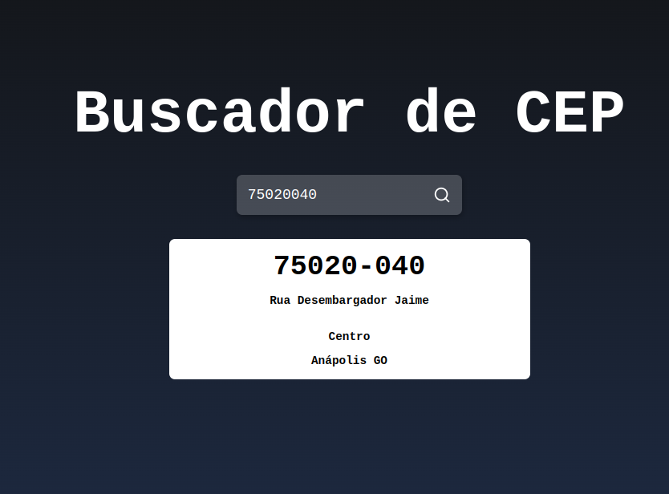

# Buscador de Cep

<center>

</center>

### Instalação

```sh
npx create-react-app buscador_cep
cd buscador_cep
npm start
```

### Comandos adicionais

```sh
npm start
npm test
npm run build
npm run eject
```

### package.json

```json
{
	...
	"scripts": {
		"start": "export PORT=84 && react-scripts start",
		"build": "react-scripts build",
		"test": "react-scripts test",
		"eject": "react-scripts eject"
	},
	...
}
```

### .vscode/settings.json

```json
{
	"git.enabled": false,
	"files.exclude": {
		"node_modules": true,
		".vscode": true,
		".gitignore": true,
		"package.json": true,
		"package-lock.json": true,
		".eslintrc.json": true,
		".eslintrc.cjs": true,
		".prettierrc.json": true,
		"vite.config.js": true
	}
}
```

### .prettierrc.json

```json
{
	"trailingComma": "none",
	"tabWidth": 4,
	"semi": true,
	"singleQuote": true,
	"useTabs": true
}
```
